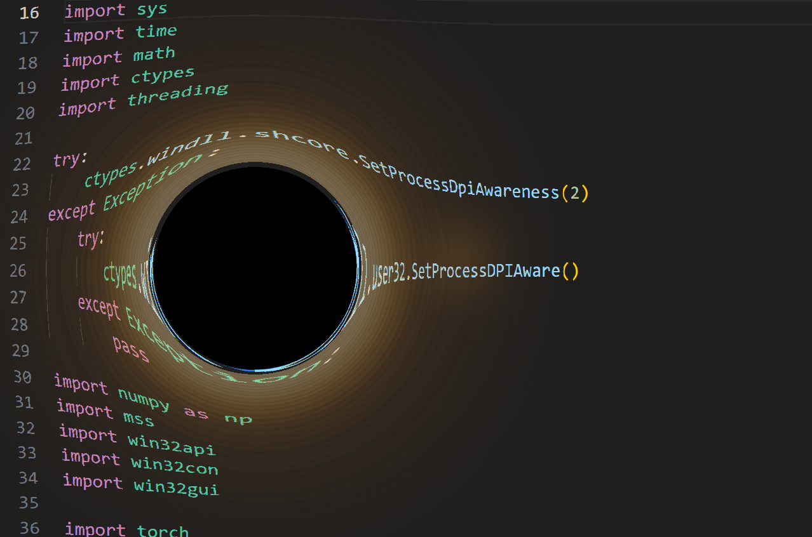

# Desktop Black Hole

一个 Windows 桌面悬浮黑洞插件。整张屏幕是它的画布：透镜把光线扭进
事件视界，外圈生成一个动态吸积盘，按 `A` 让它在四壁之间真实弹跳，
所有合成在 GPU 上完成，跟桌面无缝叠合。



## 控制

| 按键 / 操作 | 行为 |
| --- | --- |
| 左键拖拽（在事件视界内） | 移动黑洞 |
| 滚轮 | 放大 / 缩小事件视界 |
| `A` | 切换漂移模式（势能 + 动能 + 边缘弹跳） |
| `Space` | 切换吸积盘 |
| `R` | 切换"可被录屏"（默认对截图通道隐身） |
| `Esc` | 退出 |

## 运行环境

- Windows 10 / 11（用了 `WS_EX_LAYERED`、`SetWindowDisplayAffinity`、
  `SetProcessDpiAwareness` 等 Win32 API）
- NVIDIA GPU + CUDA 驱动
- Python 3.9+ 与 PyTorch CUDA 版本

```bash
# 推荐用 conda
conda create -n blackhole python=3.10 -y
conda activate blackhole

# CUDA 版 torch 从官方 index 装（CUDA 12.4 对应 cu124）
pip install torch --index-url https://download.pytorch.org/whl/cu124
pip install -r requirements.txt

python main.py
```

## 物理原理

### 引力透镜：史瓦西薄透镜近似

弱场极限下，质量 M 的黑洞对掠过的光线产生偏折角

```
α = 4 G M / (c² b) = 2 r_s / b
```

其中 `b` 是冲击参数，`r_s` 是史瓦西半径。把这个偏折角搬到屏幕上，
得到爱因斯坦薄透镜方程

```
β = θ − θ_E² / θ
```

`θ_E` 是爱因斯坦角半径。在像素坐标里令 `r_E = θ_E` 直接当作"事件
视界半径"，则像素 `(x, y)` 看到的"远端原图"位置在同方向上的

```
r_src = r − r_E² / r
```

`r ≤ r_E` 时 `r_src ≤ 0`，对应被光子球俘获的射线，渲染成纯黑视界
阴影。其余像素按 `(src_dx, src_dy) = d · (r_src / r)` 反向采样桌面
背景，就得到了引力扭曲。

### 边缘衰减窗

纯 1/r 偏折在远处仍有微弱形变，会让圆盘边缘和桌面无法完美对齐。
为此在偏折项上乘一个二次衰减窗

```
win(r) = (1 − t)²,    t = clamp((r − r_E) / (r_out − r_E), 0, 1)
deflect(r) = (r_E² / r) · win(r)
```

`r_out` 处偏折严格归零，外圈像素采样位置就是自身，圆盘外沿与桌面
完美对齐。`r_out` 跟随 `r_E` 等比例缩放（`RENDER_SCALE` 倍），所以
缩放过程中视觉边界永远稳定。

### 吸积盘：俯视角动态发光场

俯视吸积盘（face-on）的密度场用了几个简单要素叠加：

1. **开普勒差速旋转**。轨道角速度 `ω(ρ) = ω_0 · (r_in / ρ)^1.5`，
   内圈转得比外圈快，方位角相位 `θ' = θ − ω · t`。
2. **2π 闭合的 FBM 噪声**。把 `(cos θ', sin θ') · A(ρ)` 当作输入
   坐标喂给 fractal-Brownian-motion，转一整圈回到起点，避免之前在
   `θ = ±π` 处的接缝。
3. **域畸变（domain warp）**。先用一层小尺度 FBM 抖动主噪声的
   查询坐标，让条带不是规则的圆环而是不规则的湍流烟雾。
4. **内沿亮环 + 公转热斑**。`r ≈ r_E` 处叠一个高斯亮带模拟内边界
   等离子体；再加一个绕中心公转的高斯热斑做局部亮度调制。
5. **温度梯度配色**。颜色由密度自身驱动：低密度橙红、中等密度黄、
   高密度趋近黄白；用 `α = (d/D_peak)^0.65 · α_max` 做半透明 alpha
   合成，最亮处也保留 ~18% 透明度，所以背景不会被糊死。

最终颜色用经典 Porter–Duff over 合成：

```
color = (1 − α) · background + α · disk_rgb
```

### 漂移：势能 + 动能的弹跳模型

按 `A` 时给黑洞一个均匀随机方向的初速 `v₀`。屏幕内运动在四面墙
合成的反斥势 V 中演化：

```
V(x, y) = K · (1/x + 1/(W − x) + 1/y + 1/(H − y))
F = −∇V → 1/d² 的反斥力
```

用 velocity-Verlet 辛积分推进，这套积分器守恒能量，所以黑洞会在
四壁之间不断弹跳，路径就像台球——这是"反射"的来源。

如果意外飞出屏幕，加速度切换为指向中心的恒定矢量 `OUT_PULL`，同时
对速度乘以 `OUT_DAMPING^dt` 衰减——能量被人为拿走，黑洞被拽回
屏幕内并在内圈势阱里收敛。

## 实现要点

### 全屏覆盖、点击穿透、桌面采样

- `SetProcessDpiAwareness(PER_MONITOR_AWARE)` 必须在 `GetSystemMetrics`
  和创建窗口前调用，否则 Windows 会按系统缩放返回逻辑像素，SDL
  窗口只会盖住物理屏幕的一部分，这就是各种"看到边界"的根源。
- 窗口属性：`WS_EX_LAYERED + WS_EX_TOPMOST + WS_EX_TOOLWINDOW +
  WS_EX_NOACTIVATE`，配合 `LWA_COLORKEY` 把外圈洋红色像素抠成
  系统级透明。
- 鼠标穿透不靠 colorkey，靠 `WS_EX_TRANSPARENT` 的运行时切换：
  指针在事件视界内时关掉 transparent flag 接收拖拽，离开后立刻打开
  让点击穿到下层应用。
- 背景由 daemon 线程用 `mss` 持续抓取主屏，每帧上传到 GPU 张量
  作为透镜的"远端图"。

### 焦点无关的全局键盘

由于 `WS_EX_NOACTIVATE` 永不获焦，`pygame.KEYDOWN` 收不到事件。
所有快捷键（`A` / `Space` / `R` / `Esc`）都用 `GetAsyncKeyState`
轮询，并做"上一帧按下"边沿检测，避免按住连翻。

### GPU 渲染管线

每帧只在 GPU 上做：

1. 重算 lens 网格（仅当中心或半径变化）：`(src_dx, src_dy)` 离散
   场 + `shadow` / `outside` 布尔掩码。
2. 高级花式索引 `bg[sy, sx]` 反向采样桌面纹理。
3. 计算吸积盘 density → 颜色 / alpha → over 合成。
4. 视界 shadow 涂黑、外圈写 colorkey。
5. `permute(1,0,2).cpu().numpy()` 拷回主存喂给 SDL surface。

CPU 主线程只做窗口管理和事件循环，1080p / 1440p 全屏 60 FPS 满帧
没压力（实测 RTX 4060 Laptop）。

### 录屏可见性

默认调 `SetWindowDisplayAffinity(WDA_EXCLUDEFROMCAPTURE)` 把窗口
从所有 OS 截图通道隐藏，避免后台抓屏线程把自己拍进去造成无限
反馈。按 `R` 摘掉这个 flag 之后 OBS / NVIDIA Shadowplay 等录屏
工具就能录到了。

## 可调参数

所有参数集中在 [main.py](main.py) 顶部：

| 参数 | 说明 |
| --- | --- |
| `EINSTEIN_RADIUS` | 启动时事件视界半径（像素） |
| `RENDER_SCALE` | 可视圆盘外径 / 视界 比值 |
| `R_E_MAX_FACTOR` | 视界最大半径占屏幕短边的比例 |
| `DISK_INNER_FAC / DISK_OUTER_FAC` | 吸积盘内 / 外径相对 r_E 倍数 |
| `DISK_ROT_SPEED` | 外缘角速度（rad/s） |
| `DISK_TURB_OCT / DISK_WARP_AMP` | 湍流强度与畸变幅度 |
| `DISK_PEAK / DISK_MAX_ALPHA` | 亮度归一化基准与最高不透明度 |
| `DRIFT_SPEED` | A 键启动时的初速 |
| `EDGE_FORCE_K` | 边缘反斥力强度 |
| `OUT_PULL / OUT_DAMPING` | 越界后的回拉力与阻尼 |

## 参考

- Schwarzschild, K. (1916), Über das Gravitationsfeld eines Massenpunktes
- Bartelmann, M. (2010), Gravitational Lensing, Class. Quantum Grav. 27
- Luminet, J.-P. (1979), Image of a spherical black hole with thin
  accretion disk
